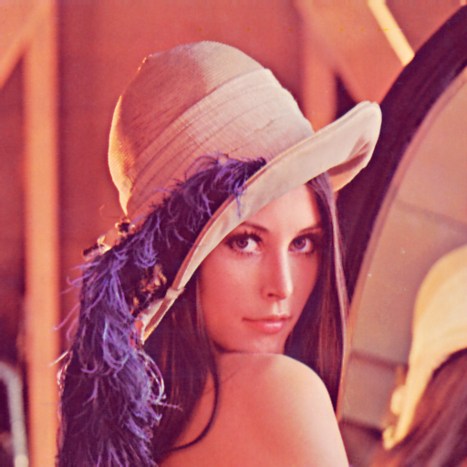
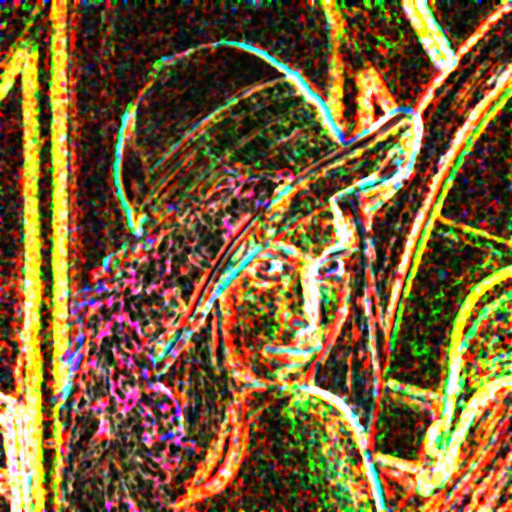

# stbidespeckle

Stb Image Despeckle.

| origin | despeckle | [stbimmetrics](https://github.com/ImageProcessing-ElectronicPublications/stb-image-metrics) (vifp1) |
| --- | --- | --- |
| (lossless) | (default opts: radius = 5, coef. = 0.25) | (black - bad, white - good) |
|  |  |  |

## build

### load submodules

submodules:
- [stb](https://github.com/nothings/stb.git) -> [src/stb](src)

```shell
$ git submodule init
$ git submodule update
```

### install dependencies

build dependencies:

- build-essential
- cmake

```shell
$ sudo apt-get install build-essential cmake
```

### compilation
```shell
$ mkdir build
$ cd build
$ cmake ..
$ make
```
## use

The first and second parameters specify the paths to the image and the result {PNG}. The `-c` option sets the despeckle factor. The `-r` option sets the radius despeckle.
```shell
./stbidespeckle [options] image_in image_out.png
options:
  -c N.N    coef (default 0.250000)
  -r NUM    radius (default 5)
  -h        show this help message and exit
```

## structure

- `dependencies.c` - API [stb](https://github.com/nothings/stb.git)
- `despeckle.h` - despeckle image.
- `stb/` - [stb](https://github.com/nothings/stb.git)
- `stbidespeckle.c` - CLI program.

---

